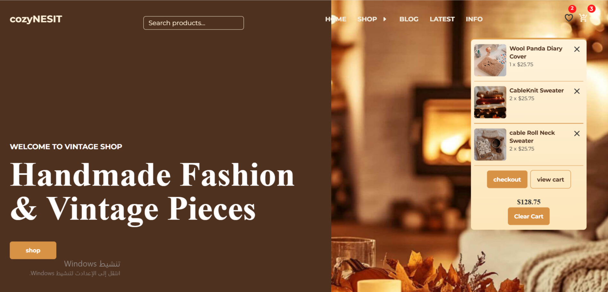

# Cozynest E-commerce
Responsive e-commerce website built with HTML, Tailwind CSS and Vanilla JavaScript

## Features :
- Product Search
- Category Filtering
- Price Sorting
- Shopping Cart
- Wishlist
- Product Details Modal
- Product Pagination 
- Checkout Form Validation
- LocalStorage Persistence

## Technologies Used :
- HTML5
- Tailwind CSS
- Vanilla JavaScript
- JSON
- LocalStorage
- Fetch API
- ES6 Modules

## Screenshots:

### Home

### Products

### Shopping Cart

### Wishlist

## Live Demo:

[View Live Demo](https://zaidabuazezi.github.io/cozynest-ecommerce/)

## Author:

Zaid Abu Azezi